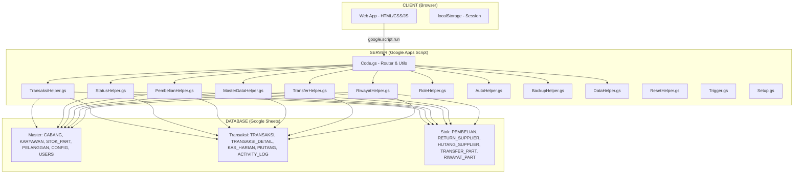

# 📚 SELURUH DOKUMENTASI PROYEK SERVICEPRO (DARI AWAL SAMPAI AKHIR)


---
## Sesi Percakapan: 0c623fa9-9440-4e93-a6ed-238baea33eb9
---

### 🗺️ Rencana Implementasi (Implementation Plan)

# Rencana Desain Efek Logo (Glowing & Drop Shadow)

Saya akan memperbarui *Styles* (CSS) dan *Scripts* Anda agar logo yang Anda masukkan dari Google Drive bisa menyala (glowing) sesuai warna cabangnya!

## Perubahan yang Akan Dilakukan

1. **Memperbarui `Scripts.html`**
   - Menambahkan kelas CSS `dynamic-branch-logo` pada gambar logo di *Sidebar* agar mudah dimodifikasi via CSS.
   - Memperbesar sedikit ukuran logo di Sidebar dari `32px` menjadi `40px` agar lebih terbaca.

2. **Memperbarui `Styles.html`**
   - **Efek Sidebar Logo:** Menambahkan efek *Drop Shadow* (Cahaya) yang bersinar di belakang logo pojok kiri atas. Warnanya akan dinamis (Biru untuk SIB, Ungu untuk BL, Kuning/Emas untuk LJ, dan Merah untuk AF).
   - **Efek Watermark Background:** Menghilangkan filter *grayscale* (hitam-putih) pada watermark agar warna asli logo Anda keluar. Lalu, saya akan menambahkan efek *Glowing* pada watermark tersebut dan sedikit meningkatkan opasitas (kecerahannya) agar lebih premium namun tetap tidak mengganggu teks.
   - Menambahkan `mix-blend-mode: screen` sebagai perlindungan seandainya gambar yang Anda upload memiliki *background* warna solid gelap/abu-abu.

### [MODIFY] Scripts.html
Akan diubah agar gambar merender *class* spesifik.

### [MODIFY] Styles.html
Menambahkan kode warna CSS Glowing untuk SIB, BL, LJ, dan AF.

## Verifikasi
Setelah kode diterapkan, saya akan melakukan `clasp push`. Anda cukup me-*refresh* browser dan akan langsung melihat logo-logo tersebut bersinar indah!


### 📋 Task Checklist

# Task Checklist: Desain Efek Logo

- `[x]` Memperbarui Scripts.html
  - `[x]` Mengganti style inline img dengan class `dynamic-branch-logo`
- `[x]` Memperbarui Styles.html
  - `[x]` Menambahkan CSS untuk `dynamic-branch-logo` dengan `drop-shadow` dinamis per cabang
  - `[x]` Memperbarui `body::after` untuk memberikan efek glowing pada watermark latar belakang
- `[x]` Menerapkan perubahan (`clasp push`)


### 📖 Walkthrough / Hasil Selesai

# Walkthrough: Efek Glowing & Drop Shadow Logo

Pekerjaan telah selesai dieksekusi dengan sukses! Berikut adalah ringkasan perubahan yang telah dilakukan pada sistem.

## Perubahan yang Diterapkan

1. **Memperbarui Sidebar Logo (`Scripts.html`)**
   - Menambahkan class `dynamic-branch-logo` ke dalam *tag image* `` saat memuat logo.
   - Logo di pojok kiri atas sekarang akan merender kelas CSS tersebut agar mudah dimanipulasi dengan berbagai efek warna di masa mendatang.

2. **Memperbarui CSS Premium (`Styles.html`)**
   - **Efek Sidebar:** Menambahkan gaya khusus untuk class `.dynamic-branch-logo`. Logo di pojok kiri atas sekarang memiliki `mix-blend-mode: screen` untuk membantu membaurkan warna *background* (abu-abu/putih) jika ada. Selain itu, logo memancarkan *drop-shadow* dengan radius warna 8px yang disesuaikan dengan cabang:
     - SIB: Biru Terang
     - BL: Ungu Terang
     - LJ: Kuning/Emas
     - AF: Merah
   - **Efek Watermark:** Memperbarui gaya elemen semu `body::after`. Kami menghapus filter `grayscale(1)` agar warna otentik logo tetap dipertahankan. Sebagai penggantinya, transparansi dasar dinaikkan menjadi `0.08`, diberikan `mix-blend-mode: screen` agar menyatu harmonis dengan *dark background*, dan akhirnya ditambahkan efek pendar besar (*drop-shadow* lebar 40px) dari belakang watermark sesuai dengan identitas warna cabangnya.

## Cara Melihat Hasilnya
Cukup buka aplikasi Google Sheets Anda, pastikan link gambar logo Google Drive sudah dimasukkan di **Sheet CONFIG** menggunakan format yang disarankan (contoh: `https://drive.google.com/uc?export=view&id=...`).
Lalu, buka Web App Kasir dan lakukan *refresh* (tekan tombol F5). 
Silakan ganti *dropdown* cabang untuk melihat transisi *glowing* dan perubahan warnanya!


---
## Sesi Percakapan: 4e28fd4b-6170-4395-b5c0-e2755101899c
---

---
## Sesi Percakapan: 5f57ca54-bd0d-45c2-a2ad-f8833ebe51ad
---

### 🗺️ Rencana Implementasi (Implementation Plan)

# Rencana Implementasi: Fitur ServicePro HP v5.2

Dokumen ini merinci rencana teknis untuk mengatasi masalah *bug* serta menambahkan fitur-fitur baru yang Anda minta.

> [!NOTE]
> **Terkait Masalah Dashboard Kosong & Error Merah:**
> Perbaikan dari percakapan sebelumnya (*parsing* tanggal yang menyebabkan error) **sudah saya push/deploy** ke Google Apps Script beberapa detik yang lalu. Masalah dashboard kosong dan error merah seharusnya sudah hilang setelah Anda *refresh* halaman. Saya juga akan menambahkan tombol "Refresh" khusus di setiap halaman laporan untuk memudahkan.

---

## 1. Perbaikan Bug & Peningkatan UI
*   **Bug Pemilihan Cabang**: Saat ini *dropdown* cabang me-reset pilihan (terutama jika *trigger* *refresh* dieksekusi secara global). Saya akan meninjau ulang fungsi `refreshDashboard()` dan `Session.isCabangLocked()` agar admin pusat (UTAMA) dapat bebas berpindah cabang tanpa ter-reset ke SIB.
*   **Tombol Refresh**: Menambahkan tombol `🔄 Refresh` yang persisten dan mudah diakses di seluruh tampilan Dashboard dan Laporan.

## 2. Dynamic Background & Logo per Cabang
*   **Logika CSS**: Menggunakan fungsi `updateBranchStyle(cab)` yang sudah ada di `Scripts.html`. Saya akan menambahkan *rules* CSS di `Styles.html` sehingga atribut `data-branch="SIB"` akan otomatis memuat `background-image` dan warna tema (skema khusus) untuk cabang tersebut.
*   **Placeholder Logo**: Untuk sementara, saya akan menggunakan warna gradasi dinamis atau ruang gambar kosong. Anda dapat mengganti URL gambarnya (menggunakan Google Drive URL) setelah fitur ini selesai.

## 3. Role-Based Access Control (RBAC) Terbatas
*   **Sembunyikan Informasi Sensitif**: Mengedit `Dashboard.html`, `LaporanLengkap.html`, dan tampilan transaksi. Jika `Session.getRole() !== 'OWNER'`, sistem akan **menyembunyikan** atau menampilkan `***` pada elemen:
    *   Laba Bersih
    *   Laba Kotor
    *   Pendapatan / Total Modal
*   **Akses Multi-cabang**: Akun Teknisi dan Admin akan dipastikan bisa digunakan di berbagai cabang jika diberi status `cabang="SEMUA"`, namun dengan *view* yang dibatasi sesuai perannya.

## 4. Sistem Kas Kecil / Kas Laci Harian (Buka & Tutup Toko)
Ini adalah fitur baru yang cukup besar. Alur (metodologi) yang diusulkan adalah sebagai berikut:

> [!IMPORTANT]
> **Metodologi Kas Harian (Buka/Tutup Toko)**
> 1.  **Form Kasir Harian**: Akan dibuatkan halaman baru (misal: "Manajemen Kasir").
> 2.  **Buka Toko**: Di pagi hari, Admin mengisi form "Saldo Awal Laci" (contoh: Rp 200.000). Sistem akan mencatat ini ke sheet `KAS_HARIAN` dengan kategori `MODAL_KASIR`.
> 3.  **Transaksi Otomatis**: Setiap transaksi *Service* atau *Pembelian Part* secara tunai (CASH) akan otomatis mengubah saldo kas di laci pada hari tersebut.
> 4.  **Pengeluaran**: Admin dapat menginput "Uang Keluar" (contoh: beli air minum Rp 10.000).
> 5.  **Tutup Toko**: Di sore hari, Admin membuka form "Tutup Toko". Sistem akan menampilkan saldo yang *seharusnya* ada (Saldo Awal + Masuk - Keluar). Admin dapat memilih berapa uang yang **disetor ke Pusat/Owner** (misal Rp 900.000) dan berapa yang **ditinggalkan di laci** untuk besok (misal Rp 100.000). Setoran ke Owner akan dicatat sebagai uang keluar dari kas cabang menuju kas utama.

---

## User Review Required

Mohon periksa **Metodologi Kas Harian** di atas. Apakah alur (Buka Toko ➡️ Transaksi Berjalan ➡️ Pengeluaran Operasional ➡️ Tutup Toko & Setor) sudah sesuai dengan yang Anda inginkan secara operasional di lapangan?

Jika Anda setuju dengan pendekatan ini, saya akan mulai menulis kodenya.


### 📋 Task Checklist

# Task List

- [x] Fix branch selection bug (Dashboard dropdown logic)
- [x] Add global Refresh buttons to all dashboards & reports
- [x] Implement Dynamic Backgrounds & Logo logic in `Scripts.html` and `Styles.html`
- [x] Implement RBAC: Hide Laba/Pendapatan for non-owner in `Dashboard.html` and `LaporanLengkap.html`
- [x] Create `KasirForm.html` for Daily Cash Drawer (Buka/Tutup Toko, Pengeluaran)
- [x] Create backend logic in `DataHelper.gs` / `TransaksiHelper.gs` for Kasir operations
- [x] Add `KasirForm.html` to `WebApp.html` and Sidebar navigation
- [x] Exclude 'Pembelian Part' from Kas Harian automatic deduction (it's paid by owner)
- [ ] Push all changes via `clasp push --force`
- [ ] Create walkthrough.md


### 📖 Walkthrough / Hasil Selesai

# Walkthrough: ServicePro HP v5.2 Updates

Update ini menghadirkan sistem manajemen kas harian yang lebih ketat, pembatasan hak akses finansial, serta branding dinamis per cabang.

## 1. Manajemen Kas Kecil (Kasir Harian)
Menu baru **💵 Manajemen Kasir** telah ditambahkan untuk mengelola uang fisik di laci setiap cabang.
- **Buka Toko**: Input modal awal laci di pagi hari.
- **Pengeluaran**: Catat biaya operasional (misal: beli air, bensin, dll).
- **Tutup Toko**: Hitung saldo akhir, tentukan jumlah setoran ke Owner, dan lihat sisa uang laci untuk besok.
- **Otomatisasi**: Transaksi Service Tunai (CASH) otomatis masuk ke saldo ini. Pembelian Part **tidak lagi** memotong kas ini (sesuai permintaan).

## 2. Hak Akses Finansial (RBAC)
Keamanan data keuangan ditingkatkan:
- **Owner Only**: Data **Pendapatan**, **Laba Kotor**, dan **Laba Bersih** kini disembunyikan dari akun Admin, Admin Limited, dan Teknisi.
- Berlaku di Dashboard, Laporan Lengkap, dan tabel Kinerja Teknisi.

## 3. Branding & UI Dinamis
- **Active View Branch**: Sistem sekarang mengingat cabang yang Anda pilih saat berpindah-pindah halaman (tidak lagi me-reset ke SIB).
- **Tombol Refresh**: Tombol `🔄 Refresh` tersedia di semua dashboard untuk memperbarui data secara manual.
- **Watermark & Logo**:
  - Background warna berubah otomatis sesuai cabang.
  - Jika Anda mengupload logo ke Google Drive dan memasukkan URL-nya di **Master Data > Config** dengan key `LOGO_SIB`, `LOGO_BL`, dsb, maka logo tersebut akan muncul sebagai *watermark* transparan di latar belakang.

## 4. Perbaikan Teknis
- **Fix Dashboard Kosong**: Masalah *parsing* tanggal dari Google Sheets yang menyebabkan dashboard kosong telah diperbaiki secara menyeluruh.
- **Deployment**: Semua perubahan telah di-*push* dan siap digunakan.

> [!TIP]
> Segera lakukan *refresh* pada browser Anda untuk memuat versi terbaru (v5.2).


---
## Sesi Percakapan: 9863c368-3edd-452b-87e6-db685927186d
---

### 🗺️ Rencana Implementasi (Implementation Plan)

# Rencana Implementasi: Fitur Tanggal Beli pada Import Stok

Sesuai permintaan Anda, kita akan menambahkan dukungan pengisian **Tanggal Beli** pada file CSV Import Stok, sehingga data Stock Opname (SO) bisa menampilkan tanggal beli yang akurat sesuai riwayat nyata.

## Masalah Saat Ini
1. Saat ini, Stock Opname mengambil "Tanggal Beli Terakhir" khusus dari tabel transaksi **Pembelian Part**. Barang yang masuk lewat Import CSV tidak masuk ke tabel Pembelian Part, sehingga tanggalnya selalu kosong (`-`) di menu SO.
2. Saat proses Import CSV dilakukan, sistem otomatis mencatat tanggal hari ini (*real-time*).

## Proposed Changes (Solusi)

### 1. [MODIFY] `ImportStok.html`
Menambahkan instruksi dan kolom `tanggal` pada format CSV yang diizinkan, sehingga contoh formatnya menjadi:
`tanggal, nama, merk, kategori, supplier, jenis, stok, hargaBeli, hargaJual`
*(Format tanggal menggunakan YYYY-MM-DD, contoh: 2024-01-25).*

### 2. [MODIFY] `AutoHelper.gs` (`importBatch`)
Menangkap data `row.tanggal` dari CSV. Jika Anda mengisi tanggal di CSV, sistem akan menggunakan tanggal tersebut. Jika dikosongkan, sistem akan otomatis menggunakan tanggal hari ini.

### 3. [MODIFY] `RiwayatHelper.gs` (`catatRiwayatPart`)
Menerima sisipan parameter `data.tanggal` dari `importBatch` agar pencatatan ke dalam tabel **Riwayat Part** tidak melulu menggunakan waktu komputer saat ini, melainkan menyesuaikan dengan tanggal dari CSV.

### 4. [MODIFY] `DataHelper.gs` (`getOpnameData`)
**Ini yang paling penting.** Daripada sistem Stock Opname hanya mengecek tabel `Pembelian`, saya akan mengubahnya agar mengecek tabel **`Riwayat Part`** (khusus barang masuk/IMPORT/PEMBELIAN). Dengan begini, baik barang yang dibeli lewat menu aplikasi maupun barang yang di-import via CSV akan sama-sama terbaca tanggal masuk terakhirnya di halaman Stock Opname.

## User Review Required
Apakah format tanggal `YYYY-MM-DD` (Tahun-Bulan-Tanggal, contoh: 2025-12-30) untuk penulisan di CSV sudah cocok untuk Anda? Jika setuju, saya akan segera mengeksekusi modifikasi ini.


### 📋 Task Checklist

# Task: Fitur Tanggal Beli Import & Sinkronisasi SO

- `[x]` Modifikasi File
  - `[x]` `ImportStok.html`: Update panduan format CSV (+ kolom `tanggal`)
  - `[x]` `AutoHelper.gs`: Tangkap `row.tanggal` dan kirim ke `catatRiwayatPart`
  - `[x]` `RiwayatHelper.gs`: `catatRiwayatPart` gunakan `data.tanggal` jika ada, else `getTimestamp()`
  - `[x]` `DataHelper.gs`: `getOpnameData` cek tanggal terakhir masuk di tabel `RIWAYAT_PART`
- `[x]` Deploy ke Google Apps Script (clasp push)
- `[x]` Update walkthrough.md


### 📖 Walkthrough / Hasil Selesai

# Walkthrough: Penyelesaian & Penambahan Fitur ServicePro HP v5.1

## 1. Perbaikan Fitur Pembayaran Hutang Supplier
**Masalah**: Sistem gagal menampilkan data hutang karena adanya masalah membaca format angka yang diinput manual dengan titik (misal `50.000`) dan memunculkan pesan "Luar biasa! Tidak ada hutang..." walau sebenarnya datanya memang kosong di cabang tersebut.
**Solusi**:
- Menambahkan validasi `Number(String(h.SISA_HUTANG).replace(/[^0-9.-]+/g,""))` untuk membaca angka kotor.
- Menambahkan layar *fallback* khusus jika memang tidak ada data hutang ("Belum ada data hutang di cabang ini...").

## 2. Perbaikan Isu Fundamental Google Apps Script Date Serialization
**Masalah**: Fungsi `getSheetData` yang mengambil data dengan objek `Date` asli dari Google Sheets gagal dikirim ke *frontend* (Web App) menggunakan `google.script.run` yang mengakibatkan seluruh data di-nol-kan (menjadi `null`).
**Solusi**:
- Menambahkan logika pencegat di `Code.gs` (`getSheetData`) yang mengecek `val instanceof Date` dan otomatis merubahnya menjadi teks format ISO / YYYY-MM-DD. Masalah ini teratasi secara global untuk seluruh modul aplikasi.

## 3. Perbaikan Bug Import Stok (Case Sensitivity)
**Masalah**: Sistem Import Stok gagal membaca nilai Harga Beli dan Harga Jual dari file CSV karena format kapital (contoh: `hargaBeli`).
**Solusi**:
- Mengubah `importBatch` di `AutoHelper.gs` agar mendeteksi *key lowercase* dari *parsed* CSV (`row.hargabeli` dan `row.hargajual`), sehingga harga tidak lagi tercatat sebagai Rp 0.

## 4. Penambahan Fitur: Tanggal Beli pada Import Stok & Stock Opname
**Masalah**: Import stok via CSV selalu mencatat waktu hari ini. Fitur Stock Opname membaca Tanggal Beli Terakhir murni dari `SHEET_NAMES.PEMBELIAN`, sehingga barang hasil *import* CSV tidak memiliki tanggal beli.
**Solusi**:
- **ImportStok.html**: Menambahkan format opsi kolom `tanggal` (YYYY-MM-DD) pada CSV.
- **AutoHelper.gs**: Menangkap `row.tanggal` dan mem-parsingnya ke dalam pencatatan.
- **RiwayatHelper.gs**: Memodifikasi `catatRiwayatPart` agar menggunakan `data.tanggal` jika disediakan, bukannya `getTimestamp()`.
- **DataHelper.gs (`getOpnameData`)**: Mengubah algoritma Stock Opname dari sebelumnya mengecek `PEMBELIAN` menjadi mengecek `RIWAYAT_PART` (khusus barang `MASUK`). Hal ini mengkover pembelian normal dari sistem DAN pembelian masa lalu yang di-import melalui CSV.

## Verifikasi
Seluruh fungsionalitas di atas telah di-deploy menggunakan `clasp push` dan siap untuk diuji coba secara langsung oleh operasional toko.


---
## Sesi Percakapan: 9ea9bf46-5767-4a8c-96e9-808162dd1326
---

### 🗺️ Rencana Implementasi (Implementation Plan)

# ServicePro HP v5.1 — Implementation Plan

> Sistem Manajemen Service HP Multi-Cabang  
> Platform: Google Apps Script + Google Sheets + Web App  
> 4 Cabang: SIB · BL · LJ · AF

---

## Overview

Build a complete multi-branch phone service management system using Google Apps Script as the backend, Google Sheets as the database, and HTML/CSS/JS Web App as the user interface. The system handles:

- **Service transactions** with multi-part support
- **Inventory management** (purchase, return, transfer between branches)
- **Financial tracking** (daily cash, accounts receivable/payable)
- **Employee management** (attendance, payroll, work reports)
- **Comprehensive reporting** with branch-level filtering
- **Role-based access** with branch-locked login profiles

---

## User Review Required

> [!IMPORTANT]
> **Google Sheets Spreadsheet ID**: You will need to create a Google Spreadsheet and provide the Spreadsheet ID so the scripts can connect to it. Alternatively, the Setup script can create all sheets automatically.

> [!IMPORTANT]
> **Deployment**: After all files are created locally, you must manually copy them into the Google Apps Script editor (script.google.com) and deploy as a Web App. The files will be organized locally for easy copy-paste.

> [!WARNING]
> **Data Volume**: The system is designed for up to 5,000 transactions. Beyond that, performance optimization (archiving old data, pagination) will be needed.

---

## Open Questions

> [!IMPORTANT]
> 1. **Spreadsheet ID** — Do you already have a Google Spreadsheet created, or should the Setup script create everything from scratch?
> 2. **Login Credentials** — Where should the username/password data be stored? In the CONFIG sheet or a separate USERS sheet? (I recommend a separate `USERS` sheet with columns: `USERNAME, PASSWORD, ROLE, CABANG, NAMA, STATUS`)
> 3. **Employee Features** — The executive summary mentions "pencatatan absensi karyawan dan penggajian, serta laporan kerja karyawan" but no sheet structure was provided. Should I add:
>    - `ABSENSI` sheet (ID, Tanggal, Karyawan, Cabang, Jam_Masuk, Jam_Keluar, Status, Keterangan)
>    - `PENGGAJIAN` sheet (ID, Periode, Karyawan, Cabang, Gaji_Pokok, Komisi, Potongan, Total, Status, Tanggal_Bayar)
>    - `LAPORAN_KERJA` sheet (ID, Tanggal, Karyawan, Cabang, ID_Transaksi, Deskripsi, Status)
> 4. **Email Notifications** — What email address should receive backup notifications and alerts?
> 5. **Komisi Calculation** — How is technician commission calculated? Flat per job, percentage of service fee, or configurable per technician?
> 6. **Language** — The UI will be in Bahasa Indonesia. Should system logs and code comments also be in Bahasa Indonesia?

---

## Architecture Overview



### Data Flow — Single Global Database

All branches share **ONE Google Spreadsheet**. Every record includes a `CABANG` column. When a user logs in:

- **Login UTAMA**: No filter — sees all data across all branches
- **Login SIB/BL/LJ/AF**: All queries filter by `CABANG = [selected branch]`

This is enforced server-side in every data read/write function.

---

## Proposed Changes

### Phase 1: Foundation & Setup (Files 1-3)

Core infrastructure — database creation, configuration, and data helpers.

---

#### [NEW] [Setup.gs](file:///f:/proyek%20service%20hp/Setup.gs)
- Create all 18 sheets (15 original + USERS + ABSENSI + PENGGAJIAN) with proper headers
- Set column widths and formatting
- Insert default CONFIG values (14 configurations)
- Insert default CABANG data (SIB, BL, LJ, AF)
- Create data validation dropdowns
- Insert default admin user account
- `setupAll()` — master function to run everything

#### [NEW] [Code.gs](file:///f:/proyek%20service%20hp/Code.gs)
- `doGet(e)` — Web App entry point, routes based on `?p=` parameter
- `include(filename)` — HTML template inclusion
- `onOpen()` — Create custom menu in Sheets
- Utility functions: `generateID()`, `formatDate()`, `formatCurrency()`
- Global constants: `SS_ID`, `SHEET_NAMES`, `STATUS_LIST`

#### [NEW] [DataHelper.gs](file:///f:/proyek%20service%20hp/DataHelper.gs)
- `getCabangList()` — Get all active branches
- `getKaryawanByCabang(cabang)` — Filtered employee list
- `getStokByCabang(cabang)` — Filtered stock list
- `cascadeDropdown(cabang, field)` — 5-level cascade: Cabang → NamaPart → Kategori → Merk → Supplier
- `autocompletePelanggan(query)` — Search existing customers
- `autocompleteNamaPart(cabang, query)` — Search parts by branch
- `getDropdownOptions(sheetName, column, filterCol, filterVal)` — Generic filtered dropdown

---

### Phase 2: Core Transaction Engine (Files 4-6)

The heart of the system — service transactions, status updates, and purchasing.

---

#### [NEW] [TransaksiHelper.gs](file:///f:/proyek%20service%20hp/TransaksiHelper.gs)
- `saveTransaksi(data)` — Save new service transaction
  - Generate unique ID (format: `TRX-YYYYMMDD-XXXX`)
  - Save main record to `TRANSAKSI` sheet
  - Save each part to `TRANSAKSI_DETAIL` sheet
  - Deduct stock from `STOK_PART` for each part used
  - Create `KAS_HARIAN` entry if payment is immediate (Cash/Transfer)
  - Create `PIUTANG` entry if payment method is BON
  - Record `RIWAYAT_PART` for each part (KELUAR)
  - Log to `ACTIVITY_LOG`
- `getTransaksiList(cabang, filter)` — Get transactions with filtering
- `getTransaksiDetail(idTransaksi)` — Get full transaction detail with parts
- `calculateTotals(parts, ongkosKerja)` — Real-time calculation

#### [NEW] [StatusHelper.gs](file:///f:/proyek%20service%20hp/StatusHelper.gs)
- `updateStatus(idTransaksi, newStatus, data)` — Update transaction status
  - Handle status transitions (any status → any status)
  - When SELESAI_DIAMBIL: finalize payment, create KAS entry
  - When BATAL: return stock, cancel related records
- `editPart(idTransaksi, partData)` — Edit/replace parts mid-service
  - Return old part to stock
  - Deduct new part from stock
  - Update TRANSAKSI totals
  - Record RIWAYAT_PART for both operations
- `getDashboardData(cabang, periode)` — Aggregate KPI data
  - Total services, revenue, profit, receivables
  - Cash in/out, balance, supplier debt
  - Status distribution, payment method breakdown
  - Recent transactions & cash entries
  - Stock overview with values

#### [NEW] [PembelianHelper.gs](file:///f:/proyek%20service%20hp/PembelianHelper.gs)
- `savePembelian(data)` — Save purchase from supplier
  - Generate ID: `BLI-YYYYMMDD-XXXX`
  - Save to `PEMBELIAN` sheet
  - Add stock to `STOK_PART` (or create new part if not exists)
  - If Cash/Transfer: create `KAS_HARIAN` entry (KELUAR)
  - If BON: create `HUTANG_SUPPLIER` entry
  - Record `RIWAYAT_PART` (MASUK)
- `saveReturn(data)` — Process return to supplier
  - Generate ID: `RTN-YYYYMMDD-XXXX`
  - Deduct from `STOK_PART`
  - If potong hutang: reduce `HUTANG_SUPPLIER`
  - Record `RIWAYAT_PART` (KELUAR)
- `getLaporanPembelian(cabang, periode)` — Purchase reports

---

### Phase 3: Supporting Operations (Files 7-10)

Master data management, transfers, history tracking, and access control.

---

#### [NEW] [MasterDataHelper.gs](file:///f:/proyek%20service%20hp/MasterDataHelper.gs)
- CRUD for `CABANG`: add, edit, delete (soft), list
- CRUD for `KARYAWAN`: add, edit, delete (soft), list by cabang
- CRUD for `STOK_PART`: add, edit, delete (soft), list by cabang
- CRUD for `PELANGGAN`: add, edit, list
- CRUD for `CONFIG`: get, set, list all
- CRUD for `USERS`: add, edit, delete, list
- All operations respect branch lock

#### [NEW] [TransferHelper.gs](file:///f:/proyek%20service%20hp/TransferHelper.gs)
- `saveTransfer(data)` — Transfer part between branches
  - Generate ID: `TRF-YYYYMMDD-XXXX`
  - Validate stock availability at source branch
  - Deduct stock at `CABANG_ASAL`
  - Add stock at `CABANG_TUJUAN`
  - Record `RIWAYAT_PART`: TRANSFER_KELUAR (source) + TRANSFER_MASUK (destination)
  - Save to `TRANSFER_PART` sheet
  - Log to `ACTIVITY_LOG`
- `getTransferHistory(cabang)` — Transfer history
- Note: Branch-locked users can initiate transfers FROM their branch TO any other branch

#### [NEW] [RiwayatHelper.gs](file:///f:/proyek%20service%20hp/RiwayatHelper.gs)
- `catatRiwayatPart(data)` — Record part movement
  - Types: MASUK, KELUAR, TRANSFER_MASUK, TRANSFER_KELUAR, RETURN, SERVICE
- `getRiwayatPart(filter)` — Get part history with filters
- `getLaporanLengkap(cabang, periode)` — Comprehensive branch report
  - Revenue breakdown, expense breakdown
  - Profit analysis, stock value
  - Employee performance, top customers
- `getLaporanKas(cabang, periode)` — Cash flow report
- `getLaporanStok(cabang, periode)` — Stock movement report

#### [NEW] [RoleHelper.gs](file:///f:/proyek%20service%20hp/RoleHelper.gs)
- `login(username, password)` — Validate credentials, return role + cabang
- `getCurrentRole(sessionData)` — Get user role from session
- `cekAkses(role, fitur)` — Check if role has access to feature
- `proteksiSheet()` — Protect sheets based on role
- Permission matrix enforcement (Owner/Admin/Teknisi)

---

### Phase 4: Automation & Maintenance (Files 11-14)

Auto-generation, backups, resets, and triggers.

---

#### [NEW] [AutoHelper.gs](file:///f:/proyek%20service%20hp/AutoHelper.gs)
- `autoGenerateID(sheetName)` — Generate sequential IDs for any sheet
- `syncValidasi()` — Sync all dropdown validation data across sheets
- `importBatch(csvData, cabang)` — Import stock from CSV
  - Validate headers and data types
  - Add to `STOK_PART` with proper IDs
  - Record `RIWAYAT_PART` for each item

#### [NEW] [BackupHelper.gs](file:///f:/proyek%20service%20hp/BackupHelper.gs)
- `backupOtomatis()` — Nightly backup (triggered at 23:00 WIB)
  - Copy entire spreadsheet to Google Drive folder 'ServicePro_Backup'
  - Filename: `ServicePro_Backup_YYYY-MM-DD_HH-mm`
  - Send email notification to owner
- `backupManual()` — On-demand backup
- `hapusBackupLama()` — Delete backups older than 7 days
- `kirimEmail(subject, body)` — Email notification utility
- `aktivasiBackupOtomatis()` — Create time-based trigger
- `matikanBackupOtomatis()` — Remove backup trigger

#### [NEW] [ResetHelper.gs](file:///f:/proyek%20service%20hp/ResetHelper.gs)
- `resetMaster()` — Clear master data, keep structure
- `resetConfig()` — Reset CONFIG to defaults
- `resetSemua()` — Reset ALL data (with double confirmation)
- All reset functions require Owner role

#### [NEW] [Trigger.gs](file:///f:/proyek%20service%20hp/Trigger.gs)
- `onEdit(e)` — Auto-sync dropdown validation when master data changes
- `createTimeTrigger()` — Set up nightly backup trigger
- `onOpen()` — Add custom menu to spreadsheet

---

### Phase 5: Web App Interface (HTML Files 1-7)

All HTML files use a consistent design system with modern, premium aesthetics.

**Design System:**
- Dark mode with glassmorphism effects
- Color palette: Deep navy (#0a0e27), Electric blue (#4f46e5), Emerald (#10b981), Amber (#f59e0b)
- Font: Inter (Google Fonts)
- Smooth transitions and micro-animations
- Fully responsive (mobile-first for phone access)
- Consistent sidebar navigation with branch indicator

---

#### [NEW] [WebApp.html](file:///f:/proyek%20service%20hp/WebApp.html)
- **Login Page**: Username/password form with branch selection
  - 5 login profiles: UTAMA, SIB, BL, LJ, AF
  - Store session in localStorage
  - Premium animated login card with glassmorphism
- **Main Navigation**: Sidebar with all menu items
  - Branch indicator (color-coded)
  - Role-based menu visibility
  - Responsive hamburger menu for mobile
- **Router**: Load content pages via `google.script.run`
- **Common CSS**: Full design system styles
- **Common JS**: Session management, API calls, notifications, modals

#### [NEW] [Dashboard.html](file:///f:/proyek%20service%20hp/Dashboard.html)
- KPI cards with animated counters (Total Servis, Pendapatan, Laba, Piutang, Kas, Saldo, Hutang)
- Status distribution bar chart (Canvas/Chart.js via CDN)
- Revenue by payment method pie chart
- Stock overview table with search
- Stock movement chart (masuk vs keluar)
- 10 recent transactions table
- 10 recent cash entries table
- Branch filter dropdown (UTAMA sees all + per-branch toggle)
- Period filter (Hari ini, Minggu ini, Bulan ini, Custom)

#### [NEW] [ServiceForm.html](file:///f:/proyek%20service%20hp/ServiceForm.html)
- Customer section: Name (autocomplete), Phone, Type (Umum/Langganan)
- Device section: HP Type, Kerusakan (text)
- Assignee: Penerima dropdown, Teknisi dropdown (optional)
- **Multi-Part Table**:
  - Dynamic rows with Add/Remove buttons
  - 5-level cascade dropdown per row: Part → Kategori → Merk → Supplier (auto-filtered by cabang)
  - Qty input, auto-fill Harga Beli & Harga Jual from STOK_PART
  - Real-time subtotal per row
- Ongkos Kerja input
- **Real-time Calculation Panel**: Total Modal, Total Jual, Laba Kotor, Komisi, Laba Bersih
- Payment method: Cash, Transfer, BON (optional for ANTRI status)
- Status selection: PROSES / ANTRI
- Catatan textarea
- Submit with loading spinner and success notification

#### [NEW] [StatusForm.html](file:///f:/proyek%20service%20hp/StatusForm.html)
- Search by Transaction ID or customer name
- Transaction detail card showing current info
- Status dropdown (7 options, can jump to any)
- Edit Part section: modify/add/remove parts
- Change Teknisi dropdown
- Add Catatan
- Save with automatic stock adjustments

#### [NEW] [MasterData.html](file:///f:/proyek%20service%20hp/MasterData.html)
- **4 Tabs**: Cabang, Karyawan, Part, Referensi/Config
- Each tab has:
  - Data table with search and pagination
  - Add New button → modal form
  - Edit button per row → modal form
  - Delete button (soft delete — set status NONAKTIF)
- Tab Cabang: ID, Nama, Alamat, Telepon, Status
- Tab Karyawan: ID, Nama, Peran, Cabang, Telepon, Status, Komisi
- Tab Part: ID, Jenis, Nama, Merk, Kategori, Supplier, Cabang, Stok, Harga Beli, Harga Jual, Status
- Tab Referensi: CONFIG key-value pairs for dropdowns

#### [NEW] [PembelianForm.html](file:///f:/proyek%20service%20hp/PembelianForm.html)
- Supplier input (autocomplete from existing)
- Cabang auto-set if branch-locked login
- Payment method: Cash, Transfer, BON
- **Multi-Item Table**:
  - Dynamic rows: Part Name, Merk, Kategori, Qty, Harga Beli
  - Auto-total per row and grand total
- Submit → updates STOK_PART, KAS_HARIAN/HUTANG_SUPPLIER, RIWAYAT_PART

#### [NEW] [ReturnForm.html](file:///f:/proyek%20service%20hp/ReturnForm.html)
- Select supplier from existing
- Select part from stock (filtered by supplier + cabang)
- Qty, Alasan
- Checkbox: Potong Hutang Supplier?
- Summary showing impact on stock and hutang

#### [NEW] [TransferForm.html](file:///f:/proyek%20service%20hp/TransferForm.html)
- Cabang Asal (auto-set if branch-locked)
- Cabang Tujuan dropdown (other branches)
- Part selection from source branch stock
- Qty (max = current stock)
- Preview showing stock changes before/after

---

### Phase 6: Reports & Advanced Features (HTML Files 8-13)

---

#### [NEW] [LaporanKas.html](file:///f:/proyek%20service%20hp/LaporanKas.html)
- Filter: Cabang, Period (date range), Jenis (Masuk/Keluar), Metode Bayar
- Table: Date, Cabang, Jenis, Metode, Kategori, Keterangan, Jumlah, Sumber
- Summary cards: Total Masuk, Total Keluar, Saldo
- Export-ready layout (print CSS)

#### [NEW] [LaporanStok.html](file:///f:/proyek%20service%20hp/LaporanStok.html)
- Filter: Cabang, Part Name, Period
- Current stock table with values
- Movement table: Masuk vs Keluar per period
- Low stock alerts (configurable threshold)

#### [NEW] [LaporanLengkap.html](file:///f:/proyek%20service%20hp/LaporanLengkap.html)
- Comprehensive branch report
- Revenue, expenses, profit analysis
- Employee performance metrics
- Top customers, top parts
- Comparison charts (if UTAMA login: branch vs branch)

#### [NEW] [RiwayatPart.html](file:///f:/proyek%20service%20hp/RiwayatPart.html)
- Full part movement history
- Filter by part name, cabang, type, period
- Timeline view showing all movements

#### [NEW] [ImportStok.html](file:///f:/proyek%20service%20hp/ImportStok.html)
- CSV upload interface
- Preview table before import
- Validation results display
- Import progress indicator

#### [NEW] [Styles.html](file:///f:/proyek%20service%20hp/Styles.html)
- Complete CSS design system as an includable template
- CSS variables for theming
- Component styles (cards, tables, forms, modals, notifications)
- Responsive breakpoints
- Animation keyframes
- Print styles for reports

#### [NEW] [Scripts.html](file:///f:/proyek%20service%20hp/Scripts.html)
- Common JavaScript utilities as an includable template
- Session management (localStorage)
- API wrapper for `google.script.run`
- Notification system (toast messages)
- Modal system
- Loading spinners
- Form validation helpers
- Date/number formatting

---

## File Summary

| Category | Count | Files |
|----------|-------|-------|
| Server Scripts (.gs) | 14 | Code, Setup, DataHelper, TransaksiHelper, StatusHelper, PembelianHelper, MasterDataHelper, TransferHelper, RiwayatHelper, RoleHelper, AutoHelper, BackupHelper, ResetHelper, Trigger |
| HTML Pages | 13 | WebApp, Dashboard, ServiceForm, StatusForm, MasterData, PembelianForm, ReturnForm, TransferForm, LaporanKas, LaporanStok, LaporanLengkap, RiwayatPart, ImportStok |
| Shared Templates | 2 | Styles.html, Scripts.html |
| **Total** | **29** | |

---

## Development Phases & Estimated Effort

| Phase | Description | Files | Priority |
|-------|-------------|-------|----------|
| **Phase 1** | Foundation & Setup | Setup.gs, Code.gs, DataHelper.gs | 🔴 Critical |
| **Phase 2** | Core Transactions | TransaksiHelper.gs, StatusHelper.gs, PembelianHelper.gs | 🔴 Critical |
| **Phase 3** | Supporting Ops | MasterDataHelper.gs, TransferHelper.gs, RiwayatHelper.gs, RoleHelper.gs | 🟡 High |
| **Phase 4** | Automation | AutoHelper.gs, BackupHelper.gs, ResetHelper.gs, Trigger.gs | 🟡 High |
| **Phase 5** | Web App UI (Core) | Styles.html, Scripts.html, WebApp.html, Dashboard.html, ServiceForm.html, StatusForm.html, MasterData.html, PembelianForm.html, ReturnForm.html, TransferForm.html | 🔴 Critical |
| **Phase 6** | Reports & Advanced | LaporanKas.html, LaporanStok.html, LaporanLengkap.html, RiwayatPart.html, ImportStok.html | 🟢 Medium |

---

## Verification Plan

### Automated Tests
- Run `setupAll()` in Apps Script editor → verify all 18 sheets created with correct headers
- Test each CRUD function via Apps Script editor's Run button
- Test `doGet()` routing with various `?p=` parameters
- Validate cascade dropdowns return correct filtered data
- Test transaction save → verify all related sheets updated correctly
- Test transfer → verify stock changes at both branches
- Test login for each profile → verify correct access restrictions

### Manual Verification
1. Deploy as Web App → test login flow for all 5 profiles
2. Create a test transaction → verify data in all related sheets
3. Test branch lock → ensure SIB login cannot see BL data
4. Test multi-part form → add 3 parts, verify stock deductions
5. Test status update flow → complete full lifecycle
6. Test purchase → verify stock increase and cash/debt records
7. Test transfer → verify stock movements between branches
8. Test dashboard → verify KPI accuracy against raw data
9. Test on mobile browser → verify responsive layout
10. Test backup → verify file created in Google Drive

### Browser Testing
- Use browser subagent to test the deployed Web App URL
- Test responsive layouts at various screen sizes
- Verify all forms submit successfully
- Test navigation flow between all pages

---

## Key Design Decisions

1. **Single Database**: All branches share one spreadsheet. Data is filtered by `CABANG` column server-side. This simplifies backup, reporting, and data integrity.

2. **Session via localStorage**: Lightweight, no server-side session management needed. Session stores: `{username, role, cabang, nama, loginTime}`.

3. **Soft Delete**: Records are never physically deleted. Status is set to `NONAKTIF` or `BATAL`. This preserves data integrity and audit trail.

4. **ID Format**: `PREFIX-YYYYMMDD-XXXX` (e.g., `TRX-20260501-0001`). Sequential within each day, guarantees uniqueness.

5. **Included Templates**: CSS and JS are in separate `.html` files included via `<?!= include('Styles') ?>` pattern. This keeps each page clean.

6. **Server-Side Filtering**: Branch lock is enforced on the server, not just the UI. Even if someone tampers with localStorage, the server validates the session cabang against every data request.

7. **Dark Mode UI**: Premium dark theme with glassmorphism for a modern, professional look. Color-coded branch indicators for quick visual identification.


### 📋 Task Checklist

# ServicePro HP v5.1 — Task Tracker

## Phase 1: Foundation & Setup
- [x] Code.gs — Router, utilities, constants (13.2 KB)
- [x] Setup.gs — Create all sheets + data awal + validasi (12.0 KB)
- [x] DataHelper.gs — Dropdown, autocomplete, data fetching (11.5 KB)

## Phase 2: Core Transaction Engine
- [x] TransaksiHelper.gs — Save transaction, multi-part, stock, kas (7.7 KB)
- [x] StatusHelper.gs — Update status, edit part, dashboard data (9.1 KB)
- [x] PembelianHelper.gs — Purchase, return, reports (7.0 KB)

## Phase 3: Supporting Operations
- [x] MasterDataHelper.gs — CRUD master data (7.2 KB)
- [x] TransferHelper.gs — Transfer part antar cabang (2.7 KB)
- [x] RiwayatHelper.gs — Part history, comprehensive reports (6.0 KB)
- [x] RoleHelper.gs — Login, access control, permissions (2.5 KB)

## Phase 4: Automation & Maintenance
- [x] AutoHelper.gs — Auto ID, sync validation, import batch (3.0 KB)
- [x] BackupHelper.gs — Backup otomatis/manual (3.8 KB)
- [x] ResetHelper.gs — Reset data (2.3 KB)
- [x] Trigger.gs — onEdit, time triggers (1.9 KB)

## Phase 5: Web App UI (Core)
- [x] Styles.html — CSS design system (20.0 KB)
- [x] Scripts.html — Common JS utilities (10.3 KB)
- [x] WebApp.html — Login + navigation + router (8.6 KB)
- [x] Dashboard.html — KPI, charts, tables (9.8 KB)
- [x] ServiceForm.html — Transaction form multi-part (13.9 KB)
- [x] StatusForm.html — Update status + edit part (12.7 KB)
- [x] MasterData.html — 4 tab CRUD (15.3 KB)
- [x] PembelianForm.html — Purchase form (5.5 KB)
- [x] ReturnForm.html — Return supplier form (4.2 KB)
- [x] TransferForm.html — Transfer antar cabang (5.2 KB)

## Phase 6: Reports & Advanced
- [x] LaporanKas.html — Cash flow report (5.0 KB)
- [x] LaporanStok.html — Stock report (4.9 KB)
- [x] LaporanLengkap.html — Comprehensive report (5.8 KB)
- [x] RiwayatPart.html — Part movement history (4.2 KB)
- [x] ImportStok.html — CSV import (5.5 KB)

## Total: 29 files, ~200 KB of code ✅


### 📖 Walkthrough / Hasil Selesai

# ServicePro HP v5.1 — Walkthrough

## ✅ Apa yang Sudah Dibuat

Seluruh sistem ServicePro HP v5.1 telah selesai dibangun — **29 file** (14 server scripts + 15 HTML pages) dengan total ~200 KB kode.

---

## 📁 Struktur File

```
f:\proyek service hp\
├── 📄 Server Scripts (.gs) — 14 file
│   ├── Code.gs            — Entry point, routing, utilities
│   ├── Setup.gs           — Create 18 sheets + default data
│   ├── DataHelper.gs      — Cascade dropdown, autocomplete
│   ├── TransaksiHelper.gs — Multi-part transactions
│   ├── StatusHelper.gs    — Status update, edit part, dashboard
│   ├── PembelianHelper.gs — Purchase, return, hutang/piutang
│   ├── MasterDataHelper.gs— CRUD all master data
│   ├── TransferHelper.gs  — Inter-branch transfer
│   ├── RiwayatHelper.gs   — Part history, reports
│   ├── RoleHelper.gs      — Login, permissions
│   ├── AutoHelper.gs      — Auto ID, sync, batch import
│   ├── BackupHelper.gs    — Automated backup
│   ├── ResetHelper.gs     — Data reset with confirmation
│   └── Trigger.gs         — Edit triggers, scheduled backup
│
├── 🌐 Web App HTML — 15 file
│   ├── Styles.html        — CSS design system (dark theme)
│   ├── Scripts.html       — Common JS utilities
│   ├── WebApp.html        — Login + sidebar + page router
│   ├── Dashboard.html     — KPI, charts, recent data
│   ├── ServiceForm.html   — Transaction form (multi-part)
│   ├── StatusForm.html    — Update status + edit part
│   ├── MasterData.html    — 4-tab CRUD (Cabang, Karyawan, Part, Config)
│   ├── PembelianForm.html — Purchase from supplier
│   ├── ReturnForm.html    — Return to supplier
│   ├── TransferForm.html  — Inter-branch transfer
│   ├── LaporanKas.html    — Cash flow report
│   ├── LaporanStok.html   — Stock report
│   ├── LaporanLengkap.html— Comprehensive branch report
│   ├── RiwayatPart.html   — Part movement history
│   └── ImportStok.html    — CSV batch import
```

---

## 🚀 Cara Deploy

### Langkah 1: Buat Project di Google Apps Script
1. Buka [script.google.com](https://script.google.com)
2. Klik **New Project**
3. Rename project menjadi "ServicePro HP"

### Langkah 2: Buat Google Spreadsheet
1. Buka [sheets.google.com](https://sheets.google.com)
2. Buat spreadsheet baru, rename menjadi "ServicePro HP Database"
3. Copy **Spreadsheet ID** dari URL (bagian antara `/d/` dan `/edit`)
4. Di Apps Script, buka **Project Settings** > **Script Properties**
5. Tambahkan property: `SS_ID` = `[Spreadsheet ID Anda]`

### Langkah 3: Copy Semua File
1. Di Apps Script editor, hapus file `Code.gs` default
2. Untuk setiap file `.gs` di folder proyek:
   - Klik **+** > **Script** > Rename sesuai nama file (tanpa .gs)
   - Copy-paste isi file
3. Untuk setiap file `.html`:
   - Klik **+** > **HTML** > Rename sesuai nama file (tanpa .html)
   - Copy-paste isi file

### Langkah 4: Jalankan Setup
1. Di Apps Script editor, pilih fungsi `setupAll` dari dropdown
2. Klik **Run** (▶️)
3. Berikan izin yang diminta (Google Sheets, Drive, Mail)
4. Tunggu hingga setup selesai — semua 18 sheet akan dibuat

### Langkah 5: Deploy sebagai Web App
1. Klik **Deploy** > **New deployment**
2. Pilih type: **Web app**
3. Description: "ServicePro HP v5.1"
4. Execute as: **Me**
5. Who has access: **Anyone** (atau sesuai kebutuhan)
6. Klik **Deploy**
7. Copy URL web app

### Langkah 6: Aktifkan Trigger
- Jalankan fungsi `createAllTriggers` untuk mengaktifkan:
  - Auto-sync validasi saat data berubah
  - Backup otomatis setiap hari jam 23:00

---

## 🔐 Default Login Credentials

| Username | Password | Role | Cabang | Akses |
|----------|----------|------|--------|-------|
| `admin` | `admin123` | OWNER | SEMUA | Akses penuh semua cabang |
| `sib` | `sib123` | ADMIN | SIB | Hanya cabang SIB |
| `bl` | `bl123` | ADMIN | BL | Hanya cabang BL |
| `lj` | `lj123` | ADMIN | LJ | Hanya cabang LJ |
| `af` | `af123` | ADMIN | AF | Hanya cabang AF |

> [!WARNING]
> **Segera ubah password default setelah deploy!** Buka Master Data > tab Users.

---

## 🏗️ Database: 18 Sheet

| Kategori | Sheet | Fungsi |
|----------|-------|--------|
| Master | CABANG, KARYAWAN, STOK_PART, PELANGGAN, CONFIG, USERS | Data referensi |
| Transaksi | TRANSAKSI, TRANSAKSI_DETAIL, KAS_HARIAN, PIUTANG, ACTIVITY_LOG | Data operasional |
| Stok | PEMBELIAN, RETURN_SUPPLIER, HUTANG_SUPPLIER, TRANSFER_PART, RIWAYAT_PART | Manajemen stok |
| Karyawan | ABSENSI, PENGGAJIAN | Manajemen karyawan |

---

## ✨ Fitur Utama yang Terbangun

1. **🔐 Multi-Login** — 5 profil login (UTAMA + 4 cabang) dengan role-based access
2. **➕ Transaksi Multi-Part** — Form dengan cascade dropdown 5 level, autocomplete, kalkulasi real-time
3. **🔄 Update Status Fleksibel** — 7 status, bisa loncat ke status manapun, edit part di tengah proses
4. **📦 Pembelian Multi-Item** — Input multi-item, otomatis update stok + kas/hutang
5. **↩️ Return Supplier** — Potong hutang otomatis
6. **🔀 Transfer Cabang** — Transfer stok antar cabang dengan riwayat ganda
7. **📊 Dashboard** — KPI animasi, chart status, metode bayar, stok rendah
8. **🗂️ Master Data** — 4 tab CRUD + Users management
9. **💰 Laporan Kas** — Filter lengkap, print-ready
10. **📦 Laporan Stok** — Stok saat ini + pergerakan
11. **📊 Laporan Lengkap** — Revenue, profit, kinerja teknisi, top pelanggan
12. **📋 Riwayat Part** — Tracking pergerakan part lengkap
13. **📥 Import CSV** — Import stok batch dengan preview
14. **💾 Backup Otomatis** — Setiap hari jam 23:00 ke Google Drive
15. **🎨 UI Premium** — Dark theme, glassmorphism, responsive, micro-animations

---

## 🔄 Alur Kerja Utama

```
HP Diterima → Input Form Transaksi → Status: ANTRI/PROSES
  → Teknisi Mengerjakan → Status: SEDANG_PROSES
  → HP Selesai → Status: SELESAI_BELUM_DIAMBIL
  → Pelanggan Bayar → Status: SELESAI_DIAMBIL ✅
  → Atau BON → Status: SELESAI_BELUM_LUNAS 💳
```


---
## Sesi Percakapan: 9fdbb5de-b1d3-43b7-a4bf-a87f19f5b86e
---

---
## Sesi Percakapan: b2a91b09-761c-4874-aff7-028c964cd9d2
---

### 🗺️ Rencana Implementasi (Implementation Plan)

# Rencana Implementasi: Perbaikan Nota & Akses Update Status

## Tujuan
Memperbaiki dua kendala utama yang Anda temukan:
1. **Nota Gagal Dimuat:** Mengatasi masalah *delay* / cache dari database (Google Sheets) agar nota langsung bisa dicetak sedetik setelah transaksi disimpan.
2. **Akses Update Status:** Mengembalikan kemudahan akses "Update Status", "Edit Part", dan "Ubah Pembayaran" langsung dengan mengklik baris transaksi di Dashboard (kembali ke kebiasaan lama), yang akan otomatis mengarahkan dan membuka detail lengkap transaksi tersebut.

## User Review Required
> [!NOTE]
> Fitur "Update Status" (termasuk edit part, ubah metode bayar, ganti teknisi, dll) sebenarnya sudah ada dan dipisah ke halaman khusus di menu samping (Menu **"Update Status"**). Namun agar Anda tidak bingung dan tetap senyaman versi sebelumnya, saya akan membuat **baris transaksi di Dashboard bisa diklik** untuk langsung melompat ke form update status tersebut. Apakah ini sesuai dengan harapan Anda?

## Proposed Changes

### 1. `TransaksiHelper.gs` [MODIFY]
- Menambahkan perintah `SpreadsheetApp.flush()` sebelum me-return ID transaksi baru di fungsi `saveTransaksi` dan `savePenjualan`.
- **Alasan:** Ini memaksa Google Sheets untuk benar-benar menulis data fisik ke dalam *cell* sebelum merespon, sehingga saat `getNotaData` dipanggil sedetik kemudian, data sudah pasti ditemukan.

### 2. `Dashboard.html` [MODIFY]
- Mengubah fungsi `renderRecentTrx()`.
- Menambahkan interaksi klik (tombol atau kursor pointer) pada baris tabel transaksi terbaru.
- Jika diklik, sistem akan berpindah halaman ke `status` dan otomatis mencari ID transaksi tersebut sehingga detail "Update Status" (termasuk tombol *Edit Part*, ubah pembayaran, dll) langsung terbuka di layar.

## Verification Plan
1. Lakukan satu transaksi servis baru.
2. Setelah sukses menyimpan, klik "Cetak Nota" pada *popup* yang muncul.
3. Nota harusnya langsung berhasil memuat data dan memunculkan *print dialog* browser.
4. Kembali ke Dashboard utama. Klik salah satu baris transaksi yang ada di tabel "Transaksi Terbaru".
5. Sistem harusnya otomatis melompat ke halaman Update Status dan langsung menampilkan rincian transaksi tersebut beserta opsi pengeditan (*Edit Part*, *Ubah Status*, dll).


### 📋 Task Checklist

# Task List: Perbaikan Nota & Akses Update Status

- [x] Modifikasi `TransaksiHelper.gs`:
  - Tambahkan `SpreadsheetApp.flush();` sebelum `return {success:true...}` di fungsi `saveTransaksi`.
  - Tambahkan `SpreadsheetApp.flush();` sebelum `return {success:true...}` di fungsi `savePenjualan`.
- [x] Modifikasi `Scripts.html`:
  - Buat fungsi global `goToStatus(id)` yang melakukan navigasi ke halaman `status`, kemudian menunggu sejenak dan mengisi kolom pencarian lalu memanggil fungsi pencarian status otomatis.
- [x] Modifikasi `Dashboard.html`:
  - Pada fungsi `renderRecentTrx()`, tambahkan aksi `onclick="goToStatus('${t.ID_TRANSAKSI}')"` di baris tabel atau tombol aksi khusus.
  - Tambahkan sedikit indikator visual (seperti kursor *pointer*) agar baris terlihat bisa diklik.
- [x] Uji coba & Deploy.


### 📖 Walkthrough / Hasil Selesai

# Walkthrough: Perbaikan Nota & Akses Status

Terdapat dua perbaikan krusial yang baru saja saya selesaikan berdasarkan laporan *bug* dari Anda:

## 1. Perbaikan Bug Cetak Nota Gagal
**Penyebab sebelumnya:** 
Google Sheets terkadang membutuhkan waktu sekian milidetik untuk memastikan data benar-benar tersimpan di dalam *cell*. Ketika Anda mengklik tombol "Simpan" pada transaksi, data terkirim, namun sistem terlalu cepat memanggil *script* Cetak Nota sebelum Google Sheets selesai mengunci datanya. Akibatnya, nota tampil kosong / gagal dimuat.

**Solusi yang Diterapkan:**
Saya telah menanamkan perintah `SpreadsheetApp.flush()` tepat sebelum transaksi dinyatakan "Sukses" di layar Anda. Perintah sakti ini memaksa Google Sheets untuk mengunci dan menyimpan data detik itu juga secara paksa, sehingga saat dialog Cetak Nota muncul, datanya sudah dijamin 100% terbaca.

## 2. Pengembalian Akses Cepat "Update Status" di Dashboard
**Penyebab sebelumnya:** 
Pada versi v5 ini, fitur Update Status, Edit Part, dan Ubah Pembayaran sudah dipisahkan ke sebuah menu utuh yang lebih besar dan rapi di panel sebelah kiri (menu **"🔄 Update Status"**). Namun karena Anda terbiasa mengklik dari Dashboard di versi sebelumnya, Anda mengira fiturnya dihilangkan.

**Solusi yang Diterapkan:**
Saya telah **menghubungkan kembali tabel Transaksi Terbaru di Dashboard**. 
Mulai sekarang, Anda bisa langsung **mengklik baris transaksi mana pun** di tabel Dashboard. Begitu diklik, sistem akan langsung melompat ke halaman "Update Status" dan secara otomatis mencari ID transaksi tersebut untuk Anda, memunculkan seluruh fitur Edit Part, Ubah Status, dan Ubah Pembayaran secara seketika!

> [!TIP]
> Arahkan kursor Anda ke tabel "Transaksi Terbaru" di Dashboard, kursor akan berubah menjadi gambar tangan (pointer), menandakan bahwa baris tersebut kini bisa diklik layaknya tombol jalan pintas!


---
## Sesi Percakapan: ceb6aea7-dfbd-46fe-b0aa-9ef7d07e67b5
---

---
## Sesi Percakapan: cf8cea71-dda3-4bbf-bd13-ae805ca0bf8d
---

### 🗺️ Rencana Implementasi (Implementation Plan)

# Proposal Peningkatan Sistem (Standar Akuntansi & Clean Code)

Berdasarkan analisis *end-to-end* sistem ServicePro HP saat ini, saya menemukan beberapa celah dari sisi "Hukum Akuntansi" (Prinsip Pembukuan Berpasangan / *Double-Entry Bookkeeping*) dan praktik *Clean Coding*. 

Berikut adalah **4 Celah Akuntansi Utama** dan **2 Celah Coding** yang perlu kita tutup agar sistem memiliki standar *Enterprise*:

## User Review Required

> [!IMPORTANT]  
> Silakan baca usulan di bawah ini. Jika Anda setuju, saya akan langsung mengeksekusinya. Jika ada yang ingin diubah (misalnya pencatatan Kas Pusat), mohon beritahu saya.

---

## 1. Celah Akuntansi: Pengembalian Uang (Cash Refund) pada Return Supplier
**Masalah:** Saat ini, jika Anda melakukan Return Barang ke Supplier, sistem hanya menanyakan "Apakah potong hutang?". Jika barang tersebut awalnya Anda beli secara **CASH (Lunas)**, maka saat direturn, Supplier seharusnya **mengembalikan uang (Refund)**. Namun, sistem kita belum mencatat uang pengembalian ini ke Kas Harian. Akibatnya uang di laci fisik akan lebih banyak daripada uang di sistem (selisih lebih).
**Solusi:**
- Pada form Return, jika opsi "Potong Hutang" *tidak* dicentang (berarti dikembalikan tunai), sistem harus otomatis membuat jurnal **KAS MASUK (Refund Return)** di buku Kas Harian.

## 2. Celah Akuntansi: Arus Kas Pembayaran Hutang Supplier
**Masalah:** Pada menu pembayaran Hutang Supplier (`bayarHutang` di `PembelianHelper.gs`), sistem sengaja tidak memotong Kas Harian cabang dengan alasan "dibayar oleh Owner". Namun, karena tidak ada buku *Kas Owner / Kas Pusat*, uang yang keluar untuk bayar hutang ini **hilang dari pembukuan (tidak ter-track sumber dananya)**.
**Solusi:**
- Membuat Sheet / Buku **KAS_PUSAT** yang khusus merekam arus kas Owner (termasuk transferan setoran cabang ke pusat, dan pembayaran hutang supplier dari pusat).

## 3. Celah Akuntansi: Pengeluaran Operasional (Opex) Lainnya
**Masalah:** Laporan Laba Rugi yang baru saja kita buat hanya menghitung `Pendapatan - HPP (Modal Barang) - Komisi Teknisi`. Laporan ini belum bisa menampung pengeluaran operasional toko seperti: Biaya Listrik, Wi-Fi, Sewa Ruko, Konsumsi, Beli ATK, dll.
**Solusi:**
- Menambahkan tombol **"Input Pengeluaran Cabang"** di form Kasir / Dashboard, sehingga pengeluaran harian cabang akan masuk ke `KAS_HARIAN` dengan jenis "PENGELUARAN_BIAYA". Laporan Laba Rugi akan otomatis memotong biaya-biaya ini agar **Laba Bersih** benar-benar *Real*.

## 4. Celah Koding: Concurrency (Tabrakan Data Stok)
**Masalah:** Fitur Pembelian dan Return baru belum sepenuhnya dibungkus dengan `LockService` (seperti yang sudah saya lakukan pada transaksi Kasir kemarin). Jika ada 2 admin di 2 cabang berbeda melakukan Return/Pembelian di detik yang sama, Google Sheets bisa tumpang tindih datanya (*race condition*).
**Solusi:**
- Membungkus fungsi `saveReturn`, `savePembelian`, dan `savePart` dengan `LockService.getScriptLock()` untuk memastikan antrean *database* berjalan satu per satu (*Thread-safe*).

---

### Verification Plan
- Jika disetujui, saya akan menambahkan form **Refund/Pengeluaran**, dan mensimulasikan kasus: *Retur barang LCD lunas seharga Rp 100.000*, lalu memastikan Kas Harian bertambah Rp 100.000 dengan deskripsi "Refund Return LCD".


### 📋 Task Checklist

# Implementasi Standar Akuntansi & Clean Code

## 1. Concurrency (LockService)
- [x] Tambahkan `LockService` pada `savePembelian` di `PembelianHelper.gs`.
- [x] Tambahkan `LockService` pada `saveReturn` di `PembelianHelper.gs`.
- [x] Tambahkan `LockService` pada `savePart` di `MasterDataHelper.gs`.

## 2. Refund Kas pada Return Supplier (Cash Refund)
- [x] Tambahkan logika di `saveReturn` (`PembelianHelper.gs`): Jika potongHutang `false`, catat uang masuk ke KAS_HARIAN sebagai "Refund Return".

## 3. Buku Kas Pusat & Pembayaran Hutang
- [x] Tambahkan `SHEET_NAMES.KAS_PUSAT` di `Code.gs`.
- [x] Buat fungsi inisialisasi sheet `KAS_PUSAT` di `Setup.gs`.
- [x] Modifikasi `bayarHutang` di `PembelianHelper.gs` untuk mencatat uang keluar dari `KAS_PUSAT`.

## 4. Pengeluaran Operasional Cabang
- [x] Tambahkan form / tombol "Pengeluaran Toko" di `LaporanKas.html`.
- [x] Tambahkan `savePengeluaran` di `TransaksiHelper.gs`.
- [x] Integrasikan pengeluaran tersebut ke dalam perhitungan `LaporanLabaRugi.html` sebagai Beban Operasional yang mengurangi Laba Bersih.


### 📖 Walkthrough / Hasil Selesai

# Laporan Implementasi Standar Akuntansi & Keamanan Sistem

Berikut adalah pembaruan sistem yang baru saja diselesaikan, berfokus pada **kepatuhan hukum akuntansi (Double-Entry)** dan **keamanan data (*Concurrency*)**:

## 1. Keamanan Transaksi (LockService)
Sistem sekarang sepenuhnya kebal terhadap "tabrakan data" (Race Condition) jika digunakan oleh banyak cabang secara bersamaan.
- **Pembelian, Return, dan Master Data** kini dibekali dengan antrean (Lock). Jika 2 admin mengeklik "Simpan" di detik yang persis sama, sistem akan memprosesnya satu per satu dengan aman tanpa membuat data ganda atau merusak kalkulasi stok.

## 2. Refund Kas pada Return Supplier
Sesuai standar akuntansi, aset yang keluar harus diimbangi dengan pemasukan.
- Ketika Anda me-return barang ke Supplier dan **tidak mencentang** "Potong Hutang" (artinya barang tersebut dulunya dibeli secara Lunas/Cash), maka uangnya akan dianggap **kembali**.
- Sistem kini akan otomatis memasukkan nominal tersebut ke **Kas Harian** sebagai Kas Masuk dengan keterangan `"Refund Return dari Supplier X"`.

## 3. Buku Kas Pusat & Pelunasan Hutang
Arus kas Anda kini tidak akan "bocor" atau hilang dari pencatatan saat melunasi hutang supplier yang ditangani langsung oleh *Owner*.
- Telah dibuat database baru yaitu **KAS_PUSAT**.
- Ketika hutang ke supplier dilunasi, uang keluar tersebut akan tercatat secara rapi di `KAS_PUSAT` dengan jenis transaksi "PEMBAYARAN HUTANG". Ini menjaga Kas Harian cabang tidak terganggu, namun *Owner* tetap memiliki jejak audit *cash outflow* (uang keluar).

## 4. Pengeluaran Operasional (OPEX) Cabang
Laba Bersih yang tertera di laporan kini adalah **Laba Bersih Real (Nett Profit)**.
- Di halaman **Laporan Kas**, terdapat tombol kuning baru **"💸 Input Pengeluaran"**.
- Admin atau Kasir bisa memasukkan pengeluaran harian toko (misalnya: Bayar Listrik, Wi-Fi, Beli Spidol/ATK, Konsumsi).
- Pengeluaran ini otomatis masuk ke Kas Harian sebagai "Pengeluaran Biaya", dan otomatis akan **memotong Laba Bersih** di menu **Laporan Laba Rugi**. Di Laporan Laba Rugi juga kini muncul indikator *Pengeluaran Toko* secara detail.

Sistem Anda kini sudah sangat siap untuk pembukuan profesional layaknya *Enterprise/Corporate*! 🚀


---
## Sesi Percakapan: d0cadb72-c2f6-4a38-8592-dac8c826621c
---

---
## Sesi Percakapan: d2a72e21-e1ea-4f7a-9069-df33b674648e
---

---
## Sesi Percakapan: d8d72429-0d7a-4170-9d70-72042920e142
---

---
## Sesi Percakapan: e0e236d7-396e-4c0d-b0bd-39dd673f49a0
---

---
## Sesi Percakapan: tempmediaStorage
---
